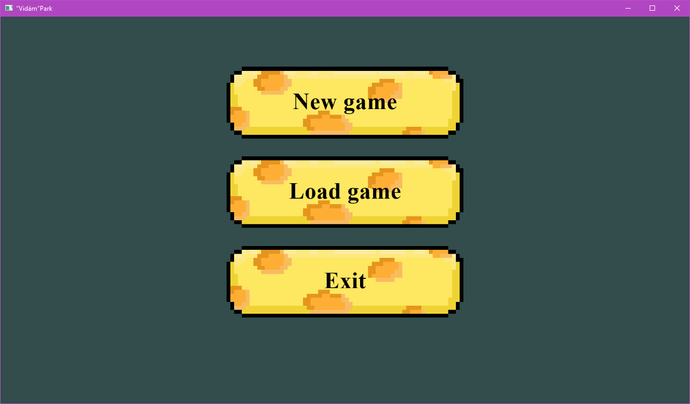
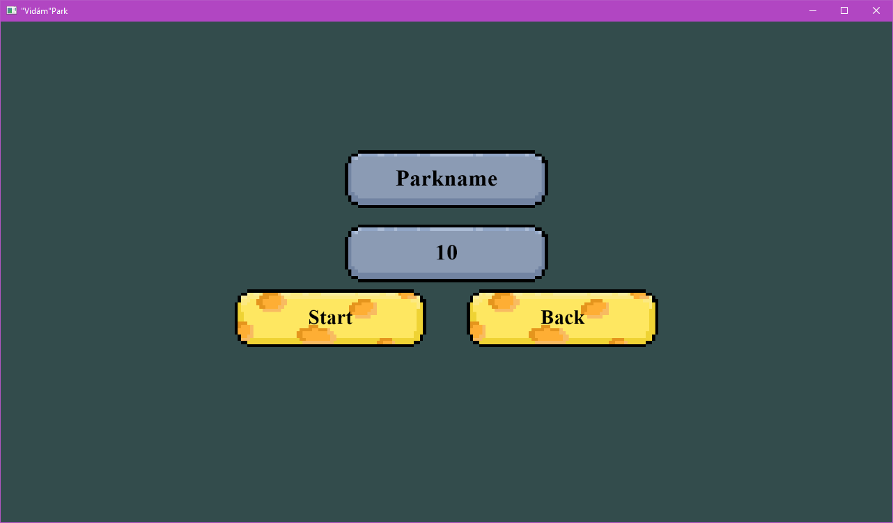
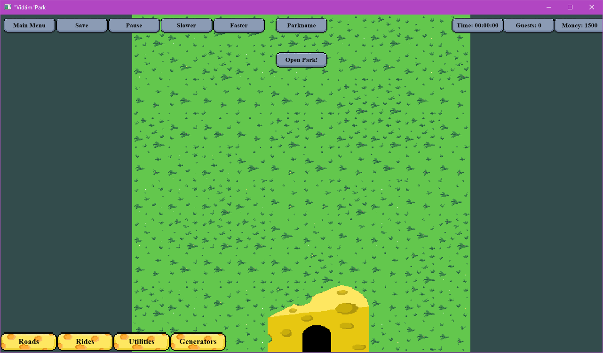
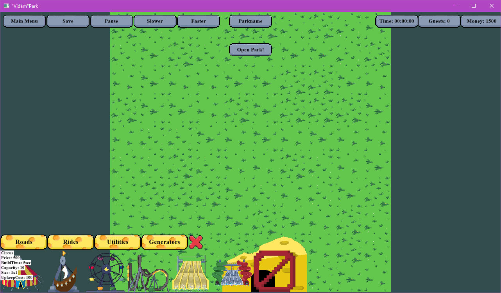
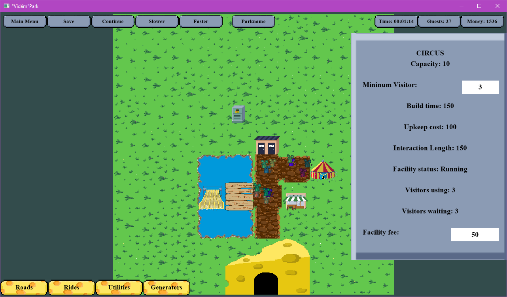

# "Vidám"Park
A program indítása után megjelenik a főmenü, itt indíthatunk új játékot vagy betölthetünk már meglévőt, illetve elhagyhatjuk ajátékot. 

----  

Új játék indítása után megadhatjuk a vidámpark nevét, valamint a pálya méretét is egy bizonyos intervallumon belül(ha nem megfelelő az érték, akkor az alapértelmezett minimum/maximumra ugrig), ezután elindul a játék.   

---

Fent található egy menüsor, ahol visszaléphetünk a menübe, elmenthetjük az adott állást, szünetelhettetjük a játék menetét, lassíthatjuk, illetve gyorsíthatjuk a játékot.
Fent középen kiírva láthatjuk a park nevét.
Kiírjuk az időt, vendégek számát és a pénz összeget.

---

Alul található az építés menü. Ha rávisszük a kurzort egy-egy épületre, akkor láthatunk egy részletes leírást róla.

---

Minden épület és vendég kattintható, ilyenkor jobb felül egy kis ablak jelenik meg a részletes adatokkal.  

---

### Csapat tagjai:
- Horváth András
- Lakatos András
- Litkei Anita
- Szekeres Bálint
